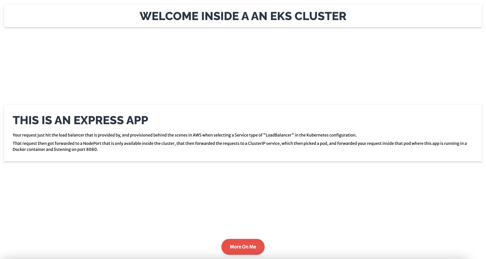
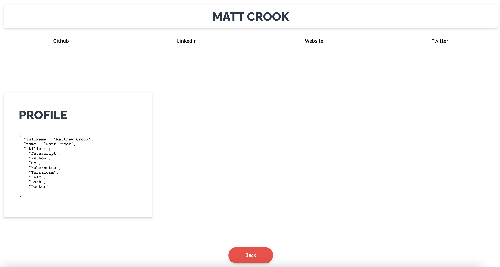

# EKS Cluster Demo App

Sample Demo application that will be deployed in the EKS Cluster, either with Kubernetes manifests or with Helm.

To experiment locally, you can also build and run the Docker image to run locally.

```
make docker_build_local

make docker_run_local
```

Go to `localhost:8080` to view app.

----




____


